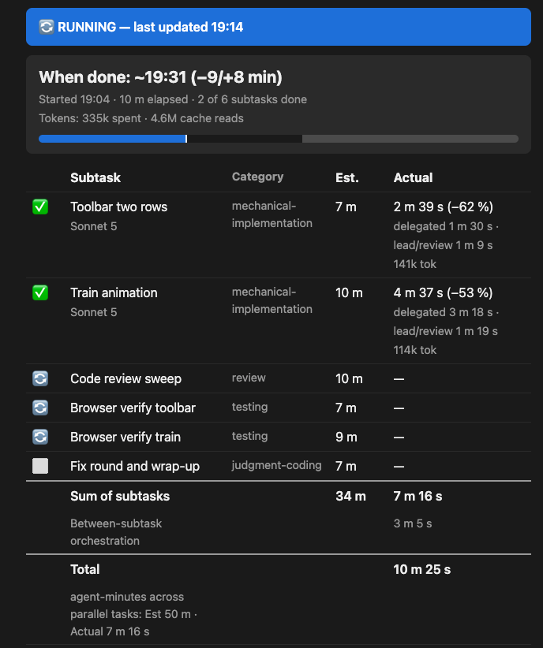
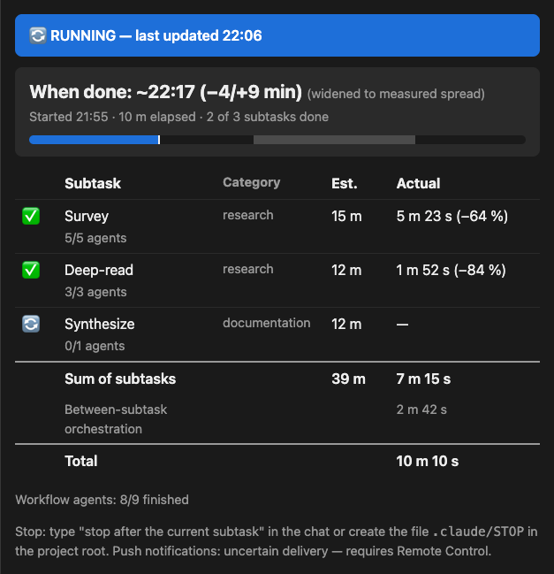

# WhenDone

Three questions matter when Claude Code runs something long: what is it doing, how big is the
job, and when will it be done? Statuslines answer the first with a heartbeat and a todo counter;
nothing answers the other two — LLM self-estimates are uncalibrated, overshooting actual duration
4–7× across 68 tasks and four model families (Garikaparthi, ["Can LLMs Perceive Time? An
Empirical Investigation"](https://arxiv.org/abs/2604.00010)). WhenDone measures instead: every
finished subtask logs estimate against actual, and a stdlib Python script — not the model — turns
that history into per-category correction factors. You get the job's live shape and a calibrated
finish time on a page that opens on any device, and a clean, resumable stop at a subtask boundary.



*Mid-run on a real 6-subtask job: two closed, three in parallel, calibrated ETA and progress bar.
The deviation column is the mechanism, not a scorecard — each close's estimate-vs-actual corrects
the next job's ETA ([provenance](docs/design.md#readme-asset-provenance)).*

## Quickstart

```bash
git clone --branch v0.8.4 --depth 1 https://github.com/WhenInSpace/whendone ~/.claude/skills/whendone
```

That clone is the whole install. Then say **"run with whendone"** when you kick off a long job —
a plan execution, a 6+ subtask fan-out, anything you'd walk away from.

## Do you need this?

The strongest case: **you have to leave, and the job can't come with you.** Internal systems the
cloud can't reach, a laptop that goes in the bag at a fixed time, a machine shut down at end of
day. WhenDone answers what that asks — *how big is this job, does it fit the time I have left?* —
with a calibrated ETA, not the model's guess; and if it doesn't fit, it stops the job cleanly at
a subtask boundary, resumably. Beyond that case:

- **Job sizing** — calibrated per-category estimates show a job's size before it starts.
- **Limit triage** — near a session or weekly cap: size a job before committing, watch live
  per-subtask spend, pause cleanly to give the rest of your window to what matters most.
- **Delegation transparency** — a per-subtask receipt of which model ran what, and what it cost.
- **Time-boxing** — a graceful stop, or a hard end time declared up front (one dogfooded run).
- **Walk-away visibility** — the live page opens on any device on your claude.ai account.

If you live in the terminal and never leave it, maybe not: a statusline (claude-hud) and
`/workflows` already show what's running where you're looking. Three things they can't — a
*calibrated* finish time, a link that **leaves the machine**, a per-subtask model/token ledger.

## What you get

- **A progress artifact** — one claude.ai page, republished at every subtask boundary.
- **Self-calibrating ETAs, candid cold start** — factors move from your first logged data point.
- **Stop and resume, session death included** — a killed session picks up in a new one.
- **Token and model attribution per subtask** — read from the transcript by a script.
- **Push notifications via Remote Control** — job done, job stopped, ETA slipping past 150 %.

The page carries the task table with actual vs. estimate, executor model, tokens per task and per
job, and an ETA with an honest interval — no dollar figures, since subscribers don't pay per
token. Interrupted subtasks are excluded from calibration rather than guessed. Notifications are
best-effort and fire at subtask boundaries, so a single hung subtask cannot alert. Run one is a
frozen default inside a nominal ±50 % band that can be off severalfold and is not yet a coverage
guarantee ([what the first runs promise](docs/design.md#cold-start--what-the-first-runs-actually-promise)).
Lead/subagent and Workflow-engine runs get the calibrated loop; plain todo-list work gets a
visibly uncalibrated pace estimate and needs a harness with a todo tool.



*A Workflow-engine run mid-flight (the 2026-08-22 re-verification run itself): live ETA with an
honest asymmetric interval — widened to the measured spread, not a fixed band — and per-phase
agent counts ([provenance](docs/design.md#readme-asset-provenance)).*

## Usage

- **"run with whendone"** / **"run without whendone"** — force it on or off for this job.
- **"stop after the current subtask"** — or create `.claude/STOP` in the project root.
- **"don't start a new subtask after 16:45"** — a hard end time, said up front.
- **"resume the job"** — pick a paused or crashed job back up, new session included.
- **"run without the artifact"** — chat-table-only, nothing published.
- **"how accurate is whendone?"** — a script-computed accuracy report from your own history.

The explicit phrase is the interface: bare hints ("how long will this take?") don't reliably
trigger it. For routine plan runs, one CLAUDE.md line does it — `When executing a plan of 6+
tasks, also invoke the whendone skill to monitor progress.` To skip publishing for a whole
project, drop in an empty `<project>/.claude/whendone-no-publish` file or set
`"publish": false` in the state file.

## Privacy

One thing leaves your machine by default: the progress artifact (task names, timings, tokens,
model names), published to claude.ai as a **default-private** page in your
`claude.ai/code/artifacts` gallery. A shared link shows every future update, and the pre-publish
check for person/client/secret-looking names is a best-effort model judgment call — review before
sharing. Either off-switch stops publishing entirely (the `.claude/whendone-no-publish` marker, or
`"publish": false`); the page then renders locally at 0600 for the in-chat table. Each job adds a
gallery page and there is no delete API, so old pages — findable by their fixed "WhenDone progress
monitor" subtitle — are yours to delete from the artifact's menu. Everything else stays local:
state file in `<project>/.claude/` (gitignore enforced before first write), calibration log in
`~/.claude/whendone-data/`, transcripts read for usage numbers, never content. The six scripts are
stdlib-only with no network access, untrusted strings are data and HTML-escaped, and resuming a
found state file needs your confirmation. Threat model:
[docs/design.md](docs/design.md#safety-decisions).

## Overhead

The mechanism is context spend: ~140 tokens in every session whether or not it fires, ≈12–14k
when it does, ~0.1–2k per subtask boundary, ~1k at job end. That amortizes at roughly **6+
subtasks or 30+ minutes**, and the skill declines smaller jobs itself. Tip: watch progress on
your phone or in a browser tab — that costs nothing. Only the IDE-embedded artifact panel adds
cost: keeping it open makes the harness re-inject the rendered page (~0.6–2k tokens) at every
watcher wake. Per-row figures, method, provenance:
[docs/design.md](docs/design.md#appendix-overhead-figures-and-measurement-history).

## Requirements and first run

Claude Code signed in to claude.ai (the live page needs the Artifact tool); API-key-only / Bedrock
/ Vertex degrade to a chat table, Cowork is expected to work but untested, claude.ai chat can't
work at all. Python 3 (`python3`, `python`, or `py`) for statistics, tokens and rendering —
without it those degrade off, and whendone never does statistics in the model. No todo tool needed
on the calibrated paths: a lead-written `completed` marker in `.claude/whendone-closes.jsonl` is
always available as close authority.

First run asks about creating `~/.claude/whendone-data/`, the `.gitignore` line, `date` calls, a
log append per checkpoint, and the publish. `Bash(date:*)` is fine to allowlist broadly. Do **not**
allowlist `Bash(python3:*)` or `Bash(printf:*)`: either pre-approves arbitrary Python or shell
execution in every project, far beyond whendone's six scripts. Scope it, e.g. `Bash(python3
~/.claude/skills/whendone/scripts/*)` — and read the test suites beside those scripts first, short
stdlib Python exercising the same code.

## Install, update, uninstall

Install on Windows (PowerShell); macOS/Linux is the Quickstart line above:

```powershell
git clone --branch v0.8.4 --depth 1 https://github.com/WhenInSpace/whendone "$env:USERPROFILE\.claude\skills\whendone"
```

A skill update is an instruction update for your agent: update tag to tag and read the diff, never
against `origin/main`. Calibration data lives outside the skill dir and survives untouched.

```bash
cd ~/.claude/skills/whendone
git fetch --tags
git log --oneline HEAD..v0.x.y
git diff HEAD v0.x.y -- SKILL.md scripts/
git merge v0.x.y   # when the diff looks right, using the new release's actual tag name
```

Uninstall removes four things (published artifacts stay in your claude.ai gallery — delete those
there yourself):

```bash
rm -rf ~/.claude/skills/whendone       # the skill itself
rm -rf ~/.claude/whendone-data          # calibration log + summary, all projects
rm <project>/.claude/whendone-state.json  # this project's job state, if present
rm <project>/.claude/whendone-tail.lock   # the watcher's single-instance lock, if present
```

```powershell
Remove-Item -Recurse -Force "$env:USERPROFILE\.claude\skills\whendone"
Remove-Item -Recurse -Force "$env:USERPROFILE\.claude\whendone-data"
Remove-Item "<project>\.claude\whendone-state.json"
Remove-Item "<project>\.claude\whendone-tail.lock"
```

## Status & maturity

Single-author side project; issues welcome, best-effort, no SLA. Dogfooded live on macOS and
Windows under Claude Code in the Claude Desktop app and the VSCode extension (macOS); the plain
terminal CLI runs the same engine and should behave identically, but has no recorded interactive
run. A 445-test suite runs on Linux, macOS and Windows in CI on every push (three symlink tests
skip on Windows without Developer Mode). Untested: resume from a fresh clone at the tag (both
drills ran in a dev tree), Cowork, the Android browser route, other Claude Code builds. Evidence
per run: [test-log](docs/test-log.md); rationale and threat model: [design](docs/design.md);
releases: [CHANGELOG](CHANGELOG.md).

## Alternatives & credits

[pocket-watch](https://github.com/MiguelDotL/pocket-watch) calibrates conversational estimates,
interactive sessions only; [claude-code-time-estimator](https://github.com/arte-ermel/claude-code-time-estimator)
closes the loop manually with one global factor;
[task-progress-bar](https://github.com/PRAFULREDDYM/task-progress-bar) renders a bar without
recording estimates; [agent-estimation](https://github.com/ZhangHanDong/agent-estimation) counts
tool-call rounds without logging actuals. None close the estimate→actual→correction loop
automatically for unattended runs — that gap is why whendone exists
([claude-code#24666](https://github.com/anthropics/claude-code/issues/24666)). Ideas adapted from
pocket-watch (shrinkage toward prior, anchoring protection), task-progress-bar (compute outside the
model) and agent-estimation (max-of-parallel-group ETA), all MIT; deviations in
[docs/design.md](docs/design.md).

## License

MIT © WhenInSpace AB
