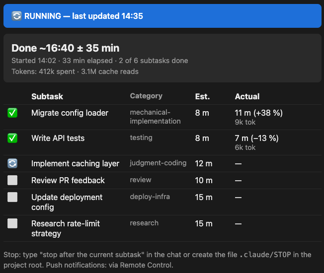

# WhenDone

WhenDone gives a long, unattended Claude Code job a calibrated finish-time ETA and a live
progress page you can open anywhere — your phone included. Declared once at job start, kept
current by a background watcher; every finished subtask feeds the calibration that sharpens
the next job's estimate. The statistics are computed outside the model.



*The actual DONE-state artifact from a real 14-subtask job — this repo's own hardening run,
monitored by whendone ([full record](docs/test-log.md#real-end-to-end-run-under-whendone-monitoring--2026-07-17),
[image provenance](docs/design.md#readme-asset-provenance)).*

## Do you need this?

The strongest case: **you have to leave, and the job can't come with you.** Internal systems
the cloud can't reach, a laptop that goes in the bag at a fixed time, a machine that must be
shut down at the end of the day. WhenDone answers the two questions that situation actually
poses — *how big is this job, and does it fit in the time I have left?* — with a calibrated
finish-time ETA, not the model's own guess (which overshoots; see below). And if it doesn't
fit, it stops the job cleanly at a subtask boundary, with state a later session resumes.

Useful beyond that case too:

- **Job sizing** — the declared plan with calibrated per-category estimates shows how big a
  job actually is and how long to expect it to take, whether or not you walk away.
- **Delegation transparency** — the task table records which model executed each subtask
  (full version, e.g. "Haiku 4.5") and what it consumed in tokens, per subtask and per job.
  If you tier work across models to protect quota, this is the after-the-fact receipt of
  what the orchestrator actually chose for each type of work and what each piece cost —
  attribution a session total can't give you.
- **Time-boxing** — "stop after the current subtask", a `.claude/STOP` file, or an up-front
  instruction like "don't start a new subtask after 16:45" (one dogfooded run so far — it's
  the declared plan plus subtask-boundary discipline that makes such an instruction
  followable).
- **Walk-away visibility** — the live page opens on any device signed in to your claude.ai
  account, phone included, and push notifications reach you via Remote Control.

If you live in the terminal and never leave it, maybe not. A statusline (e.g. claude-hud) and
`/workflows` already show you what's running, in the same window you're already watching —
that's real, and for a lot of jobs it's enough. Three things a statusline can't give you: a
*calibrated* finish-time ETA; a link that **leaves the machine** — open the live page from
a VSCode extension, a desktop app, or your phone; and a per-subtask ledger of which model
ran each subtask and what it consumed, in the same table as the estimates. If none of those
matter to you, you probably don't need whendone.

LLMs misjudge how long their own work will take — pre-task estimates overshoot actual duration
by 4–7× across 68 tasks and four model families (Garikaparthi, ["Can LLMs Perceive Time? An
Empirical Investigation"](https://arxiv.org/abs/2604.00010), arXiv:2604.00010). WhenDone closes
that loop empirically: every finished subtask logs its raw estimate against its actual duration,
per category, and a small stdlib Python script — not the model — turns that history into
per-category correction factors for the next job's ETA.

**Status:** v0.5.0 (2026-08-15), single author. Every feature claim is backed by a recorded
live run in [docs/test-log.md](docs/test-log.md) — macOS throughout, Windows verified
2026-08-13, and v0.5.0's time-attribution rework verified live on Windows 2026-08-15, on the
machine where the bug it fixes was observed. The rework has no recorded live run on macOS
(366 tests plus the Linux/macOS/Windows CI matrix there), and Sources B and C were not
re-dogfooded against it. What remains untested is listed in [Maturity](#maturity) below.

## Three sources

WhenDone attaches to a job in one of three ways, and which one it is decides whether the ETA is
calibrated:

| Source | What it is | ETA |
|---|---|---|
| **A** | Lead/subagent runs — a plan execution, a fan-out of subtasks | **Calibrated** — every finished subtask logs estimate vs. actual and corrects the next job |
| **B** | Workflow-engine runs, declared at launch | **Calibrated** — the same estimate→actual→correction loop, task list known up front |
| **C** | Plain solo / todo-list work | **Pace-based only** — visibly uncalibrated, and *never* calibrated: there's no per-subtask estimate to correct against |

## What you get

- **A progress artifact** — task table, actual vs. estimate per task, which model ran
  each subtask (full version, e.g. "Haiku 4.5", plus reasoning effort when explicitly set),
  total ETA with an honest interval, and token consumption per task and per job. The same
  account-scoped page throughout — one URL, republished at every subtask boundary. It's a
  claude.ai page (listed in your `claude.ai/code/artifacts` gallery), so it's on your desktop
  while you work and opens on any other device signed in to the same account — including your
  phone (on iOS via the browser: the mobile app's Artifacts tab doesn't list Code artifacts
  yet, so use the URL whendone posts in chat, or bookmark the gallery in Safari; on Android
  the same browser route is expected but untested).
- **Self-calibrating ETAs, honest cold start** — first runs use a frozen default table at
  ±50 %; correction factors move from your first logged data point and carry the label
  low/medium/high confidence as history accumulates. The interval ramps slower than the
  point estimate: until a category reaches high confidence (20 logged subtasks), the band is
  a flat nominal ±50/±30 % — widened to the measured spread once 5 data points exist, and
  marked "(default band — little history)" in the artifact so you can tell a default band
  from an earned one. Cold-start candor: for a category unlike the defaults (this repo's own
  `testing` ran 0.28× its default), the first-run point estimate can be off severalfold and
  the ±50 % band is a labeling convention, not a coverage guarantee — it tightens only as
  your own history accrues. No manual tuning, no cloud: the log is a local JSONL, the
  statistics are a 200-line stdlib script.
- **Graceful stop/resume — including session death** — "stop after the current subtask" or a
  `.claude/STOP` file stops cleanly; a crashed session resumes in a new one (interrupted
  subtasks are excluded from calibration, never guessed).
- **Token visibility** — output + fresh input vs. cache reads, measured from the session
  transcript by a script, shown in the artifact. No dollar figures: subscribers don't pay per
  token, so whendone won't pretend to know your bill.
- **Push notifications via Remote Control** — run Claude Code with Remote Control and the
  session mirrors to the Claude mobile app: whendone's pings (job done, job stopped, ETA
  slipping past 150 %) reach your phone and the artifact link rides along in the mirrored
  session. Best-effort — Claude decides when to push; needs the Claude app signed in with
  `/config` push enabled. Alerts fire at subtask boundaries — a single hung subtask cannot
  alert.

## Overhead — read this first if you pay per token or watch your quota

The mechanism IS context spend, so here is the short version: ~140 tokens every session,
~12k as read when it fires, ~0.1–2k per subtask boundary, ~1k at job end. Worth it for jobs
of **~6+ subtasks or ~30 minutes-plus** that you actually walk away from; the skill itself
declines smaller jobs — the trigger cost alone is hard to amortize below that.

| When | Cost |
|---|---|
| Every session, used or not | ~140-token trigger description |
| When it triggers (incl. each resume session) | ≈10.7k cl100k tokens raw, ≈12.1–12.2k as read with Read-tool line prefixes — measured 2026-08-16 after the background-dispatch/notification-close documentation pass (was ≈10.6k/≈12.0–12.1k). Covers SKILL.md, the three Source-A reference files, and the calibration-summary allowance; add ~1.5–2k for the first artifact/state writes |
| Source-B / Source-C addition | ~0 marginal at trigger — `source-b.md` (2,255 tokens) / `source-c.md` (1,008) are read only once that source is detected |
| Per watcher wake | One compact event line, **~54–341 tokens, median ~120** (measured across six real runs). When the harness re-injects the published artifact into context — in practice, when you keep the artifact panel open in the IDE — add an echo of the page HTML: ~0.6–0.8k on small jobs, ~1.7–2.0k on a 13-task job. The walk-away scenario whendone is built for (phone/browser viewing, nothing open locally) measured **zero** echoes in a controlled run — mechanism pinned by experiment, [test-log](docs/test-log.md#per-wake-re-injection-mechanism--forensics--controlled-experiment-2026-07-19) |
| Job end | ~0.8–1k tokens (final publish + full-table token script + calibration regen), scaling mildly with task count |
| Per resume (additionally) | + `references/resume.md` (≈1.6k tokens, read ONLY when resuming) + ~0.9–1.5k artifact rebuild. Deliberate trade: the rare resume path pays a little extra so every non-resume trigger stays slim |
| After a compaction notice | One re-read of SKILL.md's Invariants section + the state file ≈ ~1–1.8k tokens; recurs only on a compaction notice, not on any fixed schedule |

Rows marked measured are real `tiktoken` `cl100k_base` runs on this repo's actual files and
real session transcripts; the rest are `char/4` proxies. All counts are cl100k — Claude's own
tokenizer typically runs ~10–25 % higher on markdown/JSON like this. Full methodology,
per-row provenance, and the measurement history:
[docs/design.md](docs/design.md#appendix-trigger-figure-measurement-history).

**What's excluded:** the model's own task-execution tokens — only whendone's bookkeeping is
counted — and each wake's inference cost: a wake is one extra model turn whose full session
context is re-read at cache-read rates. For API-key users that volume (roughly wakes ×
context size) typically dominates whendone-attributable dollar cost; subscription users pay
it in latency, not money. Statistics never run in the model — calibration summaries and
accuracy reports come from the script.

## Usage — say "run with whendone"

- **"run with whendone"** / "run without whendone" — force it on or off for this job. Treat
  the explicit phrase as the interface: bare mentions ("how long will this take?") have not
  reliably auto-triggered the skill, while explicit plan-anchored invocation has worked every
  time it's been tried — single recorded runs either way, not a proven rate
  ([trigger retest](docs/test-log.md#post-rename-trigger-retest-whendone--2026-07-17)).
- Run plan executions routinely? Add one line to your CLAUDE.md:
  `When executing a plan of 6+ tasks, also invoke the whendone skill to monitor progress.`
- **"stop after the current subtask"** — graceful stop (or create `.claude/STOP` in the
  project root). For a hard end time, say it up front instead: "don't start a new subtask
  after 16:45".
- **"resume the job"** — pick a paused or crashed job back up, new session included.
- **"run without the artifact"** — chat-table-only mode: keep calibration logging and the
  in-chat progress table, skip the claude.ai publish entirely. For NDA/confidential repos
  where nothing should leave the machine, or you just don't want a gallery entry for this job.
- Set-once, per project: create an empty `<project>/.claude/whendone-no-publish` marker file
  (commit it to an NDA-repo template if you like) or put `"publish": false` in
  `.claude/whendone-state.json` — every whendone job in that project then runs chat-table-only,
  no per-session phrase needed. The artifact's gallery description is a fixed constant either
  way, never job text.
- **"how accurate is whendone?"** — a script-computed accuracy report from your own history.

## What it touches

| Data | Where it goes |
|---|---|
| Progress artifact (task names, timings, token counts, model names) | claude.ai — default-private, shareable by link; a shared link shows all future updates. Names that look like a person/client/secret get a best-effort model judgment call before first publish and when the task list changes — not a guarantee, so review before sharing a link. Hard off-switch: the `.claude/whendone-no-publish` marker or `"publish": false` (see Usage) — then nothing is published at all; the tailer still renders locally (0600) for the in-chat table. HTML-escaping applied in code by the render script. Housekeeping: each job adds one page to your gallery (there is no delete API, so whendone can't clean up for you); old WhenDone pages — findable by their fixed "WhenDone progress monitor" subtitle — are safe to delete from the artifact's own menu |
| State file | `<project>/.claude/whendone-state.json` — gitignore enforced before first write |
| Calibration log + summary | `~/.claude/whendone-data/` — never leaves your machine, survives skill updates |
| Session transcript | read locally by the token script — usage numbers only, never content |

## Security

The six shipped scripts (`scripts/calibration_summary.py`, `scripts/token_usage.py`,
`scripts/append_calibration.py`, `scripts/render_artifact.py`, `scripts/tail_progress.py`,
`scripts/workflow_journal.py`) are stdlib-only Python with no
network access — the only thing that leaves your machine is the artifact you can see. Untrusted
strings (plan files, state files, log entries) are treated as data, never instructions, and are
HTML-escaped before entering the published page. Resuming from a found
state file requires your confirmation — a cloned repo can't silently start attacker-authored
work. The statistics script whitelists categories and sanitizes every string it re-emits, so a
poisoned log line can't plant instructions in the summary future sessions read. Install is
pinned to a release tag; updating a skill means updating instructions your agent will follow —
review the diff (see Update below). Full threat model: [docs/design.md](docs/design.md).

## Requirements

- Claude Code (CLI or desktop) signed in to claude.ai — the live artifact needs the Artifact
  tool. API-key-only / Bedrock / Vertex setups: whendone degrades to a progress table in
  chat. Cowork (Claude Code's collaborative/desktop-cloud mode) is expected to work but untested.
- Python 3 (`python3`, `python`, or `py`) for calibration statistics, token display, and
  artifact rendering. Without it these degrade off — whendone never does statistics in the model.
- It does not work in claude.ai chat — there's no file system there.

## First run — what it will ask you

Expect these prompts the first time: creating `~/.claude/whendone-data/` (outside the
project), adding the state file to your `.gitignore`, Bash `date` calls, a log append at each
checkpoint, and the artifact publish to claude.ai. To pre-approve the recurring ones for
unattended runs, be deliberate about what you allowlist in `.claude/settings.json`:

- `Bash(date:*)` is low-risk and fine to allowlist broadly.
- Do **not** allowlist `Bash(python3:*)` or `Bash(printf:*)`. Either pattern pre-approves
  arbitrary Python (or arbitrary shell tricks via `printf`) execution for every tool call in
  every project — far beyond whendone's own six scripts. Scope the rule to the exact path
  instead, e.g. `Bash(python3 ~/.claude/skills/whendone/scripts/*)`.
- Before approving even the scoped pattern, review what you're approving: the shipped test
  suites (`python3 ~/.claude/skills/whendone/scripts/test_calibration_summary.py`,
  `test_token_usage.py`, `test_append_calibration.py`, `test_render_artifact.py`,
  `test_tail_progress.py`, `test_workflow_journal.py`) are stdlib
  Python and quick to read — that's the review path for all six scripts, since the tests
  exercise the same code.

## Install

```bash
git clone --branch v0.5.0 --depth 1 https://github.com/WhenInSpace/whendone ~/.claude/skills/whendone
```

Windows PowerShell:

```powershell
git clone --branch v0.5.0 --depth 1 https://github.com/WhenInSpace/whendone "$env:USERPROFILE\.claude\skills\whendone"
```

**Windows:** verified live end-to-end twice. On 2026-08-13 (Windows 11, Python 3.13,
fresh-clone install): declare-once watcher, artifact publish with live updates, per-task
token accounting, calibration logging, full job-end sequence, and stale-lock recovery after
a hard process kill — see the
[test log](docs/test-log.md#windows-verification-pass--ci-matrix--live-dogfood--2026-08-13).
Then on 2026-08-15, v0.5.0's time-attribution rework specifically, including watcher survival
across deletion of the linked worktree the job was started from — see the
[v0.5.0 entry](docs/test-log.md#windows-verification-of-the-v050-time-attribution-rework--2026-08-15).
The full suite also runs on Linux/macOS/Windows in CI on every push. One known gap: the
three symlink-containment tests skip on Windows without Developer Mode (the behavior they
guard is POSIX-verified).

## Update

A skill update is an instruction update for your agent — look before you merge. Update tag to
tag, never against `origin/main`: a moving branch can carry unreviewed work-in-progress commits
you'd otherwise merge sight unseen.

```bash
cd ~/.claude/skills/whendone
git fetch --tags
git log --oneline HEAD..v0.x.y
git diff HEAD v0.x.y -- SKILL.md scripts/
git merge v0.x.y   # when the diff looks right, using the new release's actual tag name
```

Calibration data lives outside the skill directory and survives updates untouched.

## Uninstall

```bash
rm -rf ~/.claude/skills/whendone       # the skill itself
rm -rf ~/.claude/whendone-data          # calibration log + summary, all projects
rm <project>/.claude/whendone-state.json  # this project's job state, if present
rm <project>/.claude/whendone-tail.lock   # the watcher's single-instance lock, if present
```

Windows PowerShell equivalents:

```powershell
Remove-Item -Recurse -Force "$env:USERPROFILE\.claude\skills\whendone"
Remove-Item -Recurse -Force "$env:USERPROFILE\.claude\whendone-data"
Remove-Item "<project>\.claude\whendone-state.json"
Remove-Item "<project>\.claude\whendone-tail.lock"
```

None of this touches claude.ai: any progress artifact you published stays in your
`claude.ai/code/artifacts` gallery after uninstall, still reachable by anyone holding a shared
link. Delete it there yourself if you want it gone.

## Maturity

v0.5.0 (2026-08-14), single author, tested against Claude Code CLI 2.1.209 (the exact
environment recorded for every test run in [docs/test-log.md](docs/test-log.md)); other
versions are untested, not necessarily unsupported. Since 2026-08-13 the full test suite
runs in CI on Linux, macOS, and Windows on every push.

**v0.5.0's live evidence is Windows-only, Source A only.** The time-attribution rework —
todo-transition close authority, `unconfirmed` display closes, the delegated-span split, the
`idle`/`publishLag` wakes — was dogfooded end-to-end on Windows on 2026-08-15
([test-log](docs/test-log.md#windows-verification-of-the-v050-time-attribution-rework--2026-08-15)),
which is also the first Windows execution of two of its code paths (`os.path.normcase`
artifact matching, the `OpenProcess` liveness probe — both no-ops or unused on macOS). On
macOS it has the unit suite and the CI matrix only. The Source B and Source C runs recorded
below predate it; both were deliberately excluded from the new `idle`/`publishLag` behavior,
but neither has been re-dogfooded against this release.

All three job sources were dogfooded live end-to-end (v0.3.1/v0.4.0 code; Source A again
under v0.5.0, per the Windows entry above):

- **Source A** — lead/subagent runs: live tailer/watcher run, render/publish/calibration
  end-to-end ([test-log](docs/test-log.md#stage-3--source-a-tailerwatcher-dogfood--monitoring-run--2026-07-18)).
- **Source B** — Workflow-engine runs: a live Workflow run monitored end-to-end
  ([test-log](docs/test-log.md#stage-4--source-b-workflow-engine-dogfood--live-monitor-monitoring-run--2026-07-18)).
- **Source C** — plain solo / todo-list work (TodoWrite or the newer TaskCreate/TaskUpdate
  task tools — both observed): pace-only live dogfood
  ([test-log](docs/test-log.md#stage-5--source-c-pace-only-live-dogfood--2026-07-19)).

Both cross-session resume drills were run live on 2026-07-19 — a session killed mid-job and
resumed fresh, once per calibrated source — and each found and fixed a real bug (a local-time
display bug; a killed Workflow run's leftover record falsely finalizing a job) — see
[docs/test-log.md](docs/test-log.md). What remains untested: a resume from a fresh clone at
the tag (both drills ran in the dev tree, where the installed skill dir is a symlink to this
repo). The 14-subtask run behind the hero image also used the dev tree, not a fresh clone at
the tag; that run is headless, so the hero image is a manually captured screenshot of its own
DONE artifact ([image provenance](docs/design.md#readme-asset-provenance)). Design rationale
and threat model in [docs/design.md](docs/design.md).

Windows was verified live on 2026-08-13 (Windows 11, Python 3.13): a real 8-subtask Source-A
job run from a fresh-clone install — watcher, artifact updates at every boundary, per-task
token accounting, cold-start calibration, full job-end sequence — plus a stale-lock recovery
drill (the job's own watcher hard-killed mid-run; the relaunch took over the stale lock
cleanly). That drill exercised a real Windows-only bug CI's first run had caught the same day
(`os.kill(pid, 0)` is a console Ctrl-C on Windows, not a liveness probe — fixed with an
`OpenProcess` check). Sources B and C are macOS-verified only; the three symlink-containment
tests skip on Windows without Developer Mode
([test log](docs/test-log.md#windows-verification-pass--ci-matrix--live-dogfood--2026-08-13)).

## How the calibration works

Raw estimates come from a frozen default table FIRST; only then is the per-category correction
factor applied — that ordering means the estimate never sees the factor (anchoring
protection). Completed subtasks feed a 20 %-winsorized mean of actual/estimate ratios per
category, shrunk toward 1.0 by `(n·observed + 5)/(n + 5)` — factors move from the first data
point, converge to your observed reality, and never jump. Parallel subtasks are never pooled
(overlapping wall-clock lies); each parallel group logs one synthetic row that validates the
max-of-group ETA rule instead. Full rationale: [docs/design.md](docs/design.md).

## Alternatives

[pocket-watch](https://github.com/MiguelDotL/pocket-watch) calibrates conversational estimates
via hooks but doesn't monitor runs; [task-progress-bar](https://github.com/PRAFULREDDYM/task-progress-bar)
renders a terminal bar without recording estimates; [agent-estimation](https://github.com/ZhangHanDong/agent-estimation)
estimates in tool-call rounds without logging actuals. Usage dashboards show telemetry, not
task ETAs. None of them close the estimate→actual→correction loop for agent runs — that gap is
why whendone exists ([anthropics/claude-code#24666](https://github.com/anthropics/claude-code/issues/24666)).

## Credits

Ideas adapted from three MIT-licensed projects: [pocket-watch](https://github.com/MiguelDotL/pocket-watch)
(shrinkage-toward-prior, anchoring protection), [task-progress-bar](https://github.com/PRAFULREDDYM/task-progress-bar)
(compute outside the model), [agent-estimation](https://github.com/ZhangHanDong/agent-estimation)
(max-of-parallel-group ETA). WhenDone deviates deliberately where noted in
[docs/design.md](docs/design.md).

## Project status

Single-author side project — issues welcome, best-effort response, no SLA. See
[CHANGELOG.md](CHANGELOG.md) for release history.

## License

MIT © WhenInSpace AB
